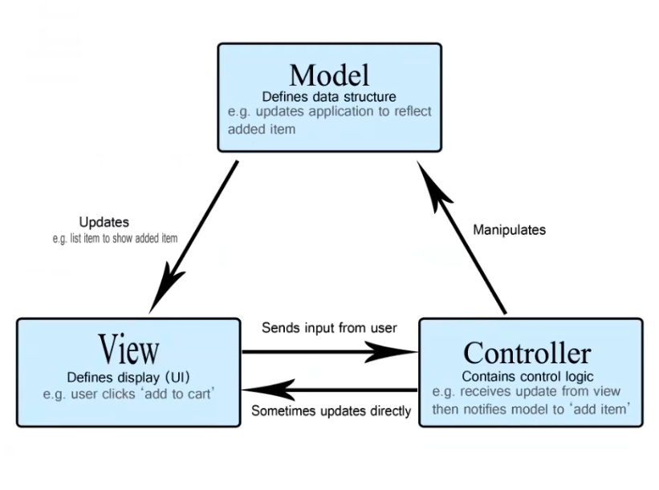
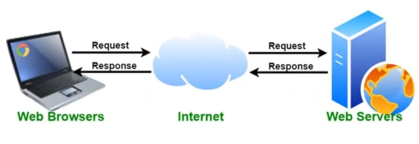

# Teorihandboken - Backendutveckling (BE)
Studerande: Fredrik GUllin

## BE 1.1 PHP
**Vad är PHP?**
PHP är akronym för "PHP: Hypertext Preprocessor" och är ett utbrett skriptspråk med öppen lällkod som används på serversidan (i backend) på en webbapplikation.

PHP är kraftfullt och är kärnan i t. ex. Wordpress som är ett av världens största bloggsystem. PHP driver flera stora sociala nätverksapplikationer och är lätt för nybörjare att lära sig.

**Hur är PHP uppbyggt och funktionalitet?**
PHP-filer kan innehålla text, HTML, CSS, Javascript och PHP. PHP-kod exekveras på servern och resultatet returneras till webbläsaren som vanlig HTML. PHP-filer har tillägget ".php".

PHP kan användas för att generera dynamiska webbsidor. PHP kan även skapa, öppna, läsa, skriva, ta bort och stänga filer på servern. Utöver detta kan PHP även samla in formulärdata, skicka och ta emot "cookies", hantera databaser (lägga till, ändra och ta bort data) samt utifrån ett säkerhetsperspektiv kontrollera och administrera användar åtkomst och kryptering av data.

PHP är inte begränsat till HTML. Man kan också mata ut bilder eller PDF-filer samt mata ut vilken text som helt som t. ex. XHTML och XML.

**Fördelar**
* PHP kan köras på olika plattformar (Windows, Linux, Unix, Mac OS X med mera)
* PHP är kompatibelt med nästan alla servrar som används idag (Apache, IIS, etc)
* PHP stöder ett brett utbud av databaser
* PHP är gratis och kan laddas ner från www.php.net
* PHP är lätt att lära sig och körs effektivt i backend

**Utseende**
PHP skrivs mellan specifika PHP-tags som ser ut på följande sätt:

<?php

$txt = "PHP";

echo "$txt är ett fantastiskt skriptspråk!";

?>

Dollar ($) tecken anvnds när man vill deklarera en variabel. Som $txt i exemplet ovan som tilldelas värdet PHP som sedan används för att skriva ut "PHP är ett fantastiskt skriptspråk!".

__Källa: https://www.w3schools.com/php/php_intro.asp__

## BE 1.2 OOP i PHP
OOP står för objekt-orienterad programmering.

Procedurprogrammering handlar om att skriva procedurer och funktioner som utför operationer på datan, medan objektorienterad programmering handlar om att skapa objekt som kan innehålla både data och funktioner.

Det finns flera fördelar med objektorienterad programmering om man jämför med procedurell programmering.

* OOP är snabbare / och enklare att utföra
* OOP ger en tydlig struktur för programmet man utvecklar
* Med OOP kan man undvika upprepningar av kod (DRY - don't repeat yourseld), samt är enklare att underhålla och felsöka tack vare dess strukturella uppbyggnad
* OOP möjliggör skapandet av återanvändbara applikationer med mindre kod och kortare utvecklingstid

**DRY principen**
Don't repeat yourself principen (DRY) handlar om att minska upprepning av kod. Som utvecklare bör man extrahera de koder som är vanliga för applikationen och placera dem på en enda plats och återanvända dem istället för att upprepa det. Detta kan OOP hjälpa till med.

**OOP, klasser och objekt**
Klasser och objekt är de två huvudsakliga aspekterna av objektorienterad programmering.

Jag ska försöka förklara dessa aspekter på ett enkelt sätt. Låt oss säga att vi skapar en klass "frukt", i detta fall skulle till exempel "äpple", "banan" och "päron" vara objekt av klassen frukt. Eller låt oss säga att vi skapar klassen "bil", då skulle "Volvo", "Audi" och "Toyota" vara objekt av klassen bil.

En klass kan förklaras som en mall för ett objekt, och ett objekt är en instans av en klass.

När ett enskilt objekt skapas så äver det alla egenskaper och beteenden från klassen, men varje objekt som skapas kan ha olika värden för dessa egenskaper.

## BE 1.3 Säkerhet i PHP
**Vad är säkerhet?**
Det man brukar prata om är applikationssäkrehet vs IT-säkerhet.

* Applikationssäkerhet: Hur vi säkrar information och skyddar delar i vår applikation från attacker. Med andra ord applikationens egen säkerhet.
* IT-säkerhet: Hur vi skyddar, konfigurerar och ser till att våra system (fysiska och digitala) är säkra.

**IT-säkerhet**
Inom IT-säkerhet talar man oftas om sårbarheter (vulnerabilities). Man syftar då på svagheter eller brister med implementationen eller lösningarna i antingen system eller fysisk hårdvara. Dessa svagheter kan utnyttjas för att få tillgång till systemet där man också kan ställa till oreda eller skada.

**Hacking**
Hacking kan beskrivas som när man försöker ta sig in och få tillgång till ett system. Med andra ord är hacking de handlingar / aktiviteter man utför för att få tillgång till och kompromettera digitala enheter och nätverk. _Hacking är även ett gammalt svenskt uttryck för allmän datavetenskap / programmering (brukas oftast de som lärde sig programmering för ca 20 år sedan)._

**Det finns olika tillvägagångssätt för hacking:**

* Botnät - Förkorttning av botnätverk, kan beskrivas som ett nätverk av kapade datorer som genom "malware" kontrolleras av en hacker. Botnätet kan användas för spamming eller DDos attacker.

* Webbläsarkapning - Innebär att användaren blivit inlurad på en sida som styrs av en hacker men som ser ut som en vanligsida. I allvarliga fall kan detta leda till stöld av inloggningsuppgifter och känslig information.

* Denial of service (DDos) attacker - Innebär att en väldigt stor mängd samtidigt "pingar" / skickar olika kommandon till en server så att den blir överbelastad och får en virtuell explosion. Detta leder långa svarstider och "downtime" (out of service) som även kan öppna svagheter som kan utnyttjas för att ta sig in.

* Ransomeware - Låser ner datorn tills dess att ägaren av datorn betalar en summa pengar till hackern för att låsa upp systemet igen.

* Rootkits - Är mjukvara som används av hackers för att ta kontroll över någon annans dator.

* Trojaner - Är ett program som laddats ner och installerats på datorn som verkar ofarligt men som egentligen innehåller någon typ av skadlig kod. Kan användas för diverse olika syften.

* Virus - Skadligkod som tagit sig in i datorns system som tillexempel trojaner eller ransomware.

* Maskar - En mask är ett slags virus som kopierar- och sprider sig själv vidare till andra datorer genom till exempel e-post.

**Varför vill man hacka?**

Pengar är en bra anledning och ett starkt motiv för att hacka andra människor. Vissa kan göra detta för att "busa" och "jävlas" med andra. Det finns även olika hacker communities som till exempel Anonymous som har sina egna agendor och strukturer. Det kan även användas för olika typer av spionage och används både av olika statliga säkerhetstjänster och privata aktörer för att få fördelar i en värld där information är en allt mer eftertraktad valuta.

Det finns även "goda hackers" som till exempel "hacktivister", "white hats" eller "ethical hackers" som hackar med intentionen att uppmärksamma olika företags säkerhetsbrister. Dessa hackers hackar med goda intentioner, med gott syfte. "Ethical hacking - open the gate just alittle".

**Applikationssäkerhet**

I applikationskitet behöver utvecklare ha koll på sårbarheter i applikationen som utvecklas. Genom att hantera dessa sårbarheter minskar man risken för att applikationen går att hacka. _Man kan läsa mer om de 10 vanligaste sårbarheterna genom att titta på OWASP (open web application security project)._

Några av dem som brukar vara högt upp på listan är:

* Injecering - en brist där opålitliga kommandon kan skickas med i t.ex. SQL-queries (SQL-injektioner) och utföra skadliga operationer.
* Bruten autensering - när en applikations autenseringsflöde är brutet kan användaruppgifter och annan känslig information komprometteras.
* Exponering av känslig data - När APIer inte skyddar känslig data på ett korrekt sätt. Detta kan kompromettera personliga användaruppgifter.

Om säkerheten brister inom dessa områden kan hackare komma åt känslig användarinformation som t.ex. namn, efternamn, adress, lösenord och kreditkortsuppgifter.

* XXE (XML-Exteral Enteties) - När äldre versioner av XML-tolknngsmjukvara oavkortat läser externa referenser. Dessa externa referenser kan användas för att lista interna filer på disk, öppna portar och för att köra egen kod på servern.

* Bruten auktorisering (användarkontroll) - När en applikations auktorisering är bruten kan olika typer av användare få rättigheter till andra användares information, eller t.ex. administrativa funktioner. Det säkraste sättet att "logga" in är genom tredjeparts autensering t.ex. med bankID.

* Felaktig säkerhetskonfiguration - Den vanligaste förekommande bristen. Uppstår när en konfiguration för t.ex. system, ramverk, eller bibliotek saknar korrekt konfiguration för att kunna användas säkret i produktionsmiljö. _Detta är extremt lätt att misslyckas med om man inte kontinuerligt jobbar med detta._

* Cross-Site Scripting (XSS) - Är en brist som uppstår när en applikation inkluderar opålitlig data in i en ny sida utan validering. En XSS attack låter en hackare köra skript i användares webbläsare och kan då få tag i användarsessioner, vanställa webbplatser eller dirigera om användare till skadliga webbplatser.

* Osäker deserialisering - Om deserialisering görs på ett osäkert sätt kan sårbarheten utnyttjas. Denna brist möjliggör flera olika typer av attacker.

* Användning av komponenter med kända säkerhetsbrister - När bibliotek, ramverk etc, som har kända säkerhetsbrister utnyttjas. Kan resultera i förlorad data eller till och med övertagande av en server.

* Otillräcklig loggning och övervakning - När loggar och övervakning är bristande eller saknas kan attacker fortsätta obemärkt och på sikt lyckas manipulera, få ut eller ta bort data. De flesta studier visar att det tar över 200 dagar för att upptäcka ett intrång. Vilket ofta upptäcks av en extern part, snarare än internt.

En ytterligare faktor för säkerhet man bör ha i åtanke är att inte spara användares lösenord i klartext i ens databas. Man bör använda någon form av kryptering. Det finns olika algoritmer för att kryptera ett lösenord eller "hash a password". Några exempel på hash-algoritmer är SHA-1, SHA-2 (SHA-256, SHA512), Whirlpool, Tiger, AES, Blowfish och MD5 (som länge var det vanligaste sättet). Man bör således använda en funktion för att "hasha" eller "salta" lösenordet när man sparar det och således även använda en funktion för att "dehasha" lösenordet när användaren t.ex. loggar in. I PHP finns funktionerna password_hash() och password_verify() för detta ändamål.

En framgångsrik inställning är att se användardata som potentiellt skadlig och på olika sätt skydda sig mot detta. I förlängningen innebär även detta att även sparad data från databasen potentiellt kan vara skadlig då denna kommer från användare. Man bör därför överväga detta tankesätt när man utvecklar en applikation för att göra denna så säker som möjligt.

Ett sätt att skydda sig mot skadlig användarinput (även kallat injektioner) kan vara att använda sig av funktionerna htmlspecialchars() och strip_tags() i PHP. Dessa funktioner saniterar inputen då den inte tillåter html specifika symboler (t.ex. & " ' < >), vilket förhindrar användare från att skicka in direkt skadliga skript i databasen.

**CSRF-token**
Ett CSRF-token är ett token som skyddar mot CSRF-requests.

En CSRF-request kan beskrivas som ett post-request som skickas från en "elak" hemsida med syfte att kapa en användares konto. Ponera att en förövare lurar in en användare på en elak hemsida där han skapat en HTML form som till exempel pekar mot _din-applikations-url.com/user/emal._ På detta sätt kan förövaren skicka "elaka" post-requests i databasen och på så vis t.ex. ta över användarens konto med mera.

För att skydda sig mot detta använder man ett CSRF-token som egentligen är en säkerhetsnyckel som är kopplad till den inloggade användarens session. Nyckeln behövs för att kunna manipulera data i databasen och får ett nytt värde varje gång sessionen uppdateras och är på så vis oåtkomlig för andra. Om någon försöker ändra något i databasen utan denna nyckel kommer försöket att avisas.

Detta är en inbyggd säkerhetsfunktion i Laravel som är mycket enkelt att använda. Genom att lägga till @csrf direkt i HTML formen så skapas ett dolt "input fält" som skickar med sessionens unika säkerhetsnyckel när användaren trycker på "submit" och postar något. Därefter tar Laravel emot "post-requesten", inklusive CSRF-token och ger tillåtelse att ändra data i databasen.

_Källa: Föreläsning "Säkerhet i PHP" av Sebastian Lindgren den 16 januari 2023 samt föreläsning "Laravel fortsättning" av Sebastian Lindgren den 1 februari 2023_

## BE 1.4 MVC
MVC är generellt ett sätt att tänka när man strukturerar sin kod och som kan implementeras med alla språk som visar för, tar emot data från och sparar data åt en användare i en databas.

**Vad är MVC och varför bör man använda det?**

_För att kunna veta vad MVC är och varför vi behöver det kan vi börja med att tänka på vad vi vill att våra applikationer ska göra._

MVC står för "Model View Controller" och representerar den arkitektur utvecklare implementerar när de utvecklar applikationer. När MVC arkitektur implemmenteras tar man hänsyn till strukturen av applikationens dataflöde och används när man arbetar med user interfaces, data och controllers. Det separerar även en applikations logiska del och det som hanterar det som visas på skärmen. Uppdelningen underlättar underhåll av applikationen.

Uppdelningen ser oftast ut på följande sätt:

* Model - Hanterar data och logik
* View - Hanterar layout och skärmrelaterat innehåll
* Controller (och routes) - Hanterar requests och "route commands" för modellen och vyerna 

När man arbetar med MVC så strävar man även efter att strukturera projektet på ett standardiserat sätt. På så vis kan man organisera sina models, views, routs, controllers och migrations så att det alltid är lätt att hitta det man behöver. Detta underlättar om man ska hoppa in i ett nytt projekt eller om man arbetar i ett större projekt.

Ett återkommande begrepp inom MVC eller programmering generellt är "separation of concerns" och "design patterns" vilket kortfattat syftar på uppdelningen av en applikations olika delar eller lager som beskrivs ovan.

Utöver detta så  används MVC för att reducera komplexiteten i koden, förenkla återanvändning av kod, öka flexibiliteten.

_D*RY - Don't * Repeat Yourself!_

_Källa: Föreläsning "MVC intro" av Sebastian Lindgren den 26 januari 2023_

## BE 1.5 Wordpress
Beskriv rubriken här

## BE 1.6 Heirarkiska databaser
Beskriv rubriken här

## BE 1.7 Relationsdatabaser, SQL och ER-modellering
Beskriv rubriken här

## BE 1.8 OAuth i backend
Beskriv rubriken här

## BE 1.9 HTTP-protokollet
Beskriv rubriken här

## BE 1.10 cURL
cURL är ett terminalverktyg som möjliggör utbyte av data mellan en enhet och en server genom en terminal. 

Genom att använda detta CLI (command line interface) så kan en användare ange en specifik server URL (adressen dit de vill skicka en request) och den data de vill skicka till serverns URL.

Till skillnad från andra liknande verktyg för detta ändamål så använder cURL endast terminalen och saknar ett GUI. cURL fungerar på Linux, Mac och Windows.

cURL använder "libcURL client-side URL transfer library" som stödjer många olika "transfer protocols" så som HTTPS, SMTP och FTP. Det erbjuder även en möjlighet att inkludera "cookies", sätta upp proxys och lägga till en auktoriserings metod för olika requests.

cURL kan användas för att testa en API, ladda ner data från olika källor, testa webbsidor och följande "redirects" genom terminalen.

cURL kan kombineras med olika kommandon för att utföra olika uppgifter så som GET, POST, PUT, PATCH och DELETE. För att visa hur detta går till kommer jag ge några exempel på hur ett curl-kommando är uppbyggt.

**GET**
curl -X GET http://localhost:3000/posts

Detta kommandå hämtar all data från databasen på angiven URL. I detta fall databasen på localhost, port 3000, posts.

Denna data kommer därefter skrivas ut i terminalen där vi kan ta del av informationen som finns i posts.

**POST**
curl -X POST -d 'title=hello' -d 'author=Freddo' http://localhost:3000/posts

Detta kommando kommer skapa en ny post i posts med title "hello" och author "Freddo" i databasen på localhost, port 3000, posts.

**PUT**
curl -X -d 'title=hello' -d 'author=Freddo' http://localhost:3000/posts/1

Detta kommando kommer ändra den befintliga posten med id 1 (om vi utgår ifrån att det ursprungligen fanns en post med id 1) till title "hello" och author "Freddo".

Observera att PUT ändrar de parametrar man anger men raderar / skriver över övrig data som eventuellt finns i denna post.

**PATCH**
curl -X PATCH -d 'title=newHello' http://localhost:3000/posts/1

Detta kommando kommer endast ändra title på posten med id 1 (ovanstående post) till "newHello" men övrig data lämnas oförändrad.

**DELETE**
curl -X DELETE http://localhost:3000/posts/1

Detta kommande kommer radera post med id 1 från databasen.

_cURL som egentligen uttalas curl är ett mycket enkelt, snabbt och bekvämt sätt att hantera och testa t.ex. ett API och kommer bli en mycket älskvärd kompanjon senare i arbetslivet._

_Källa: Föreläsning "Dataformat curl och PHP inlogg" av Sebastian Lindgren den 19 januari 2023_

## BE 1.11 REST
Beskriv rubriken här

## BE 1.12 XML och andra dataformat
Beskriv rubriken här

## BE 1.13 Webbservrar
Ordet webbserver syftar både på själva datorn (hårdvaran) som används för ändamålet och även på det program som sköter innehållet och kommunikationen för tjänsten som servern tillhandahåller.

**Men vad innebär detta?**

Det finns många olika typer av servrar så som applikations- och webbservrar (samt dess hårdvara), men också databas-servrar, fax-servrar, mail-servrar, spel-servrar med mera.

**Hårdvara**

I detta avsnitt går vi igenom hårdvarusidan av en webbserver.

Som bilden beskriver finns en dator på ena sidan som skickar en request som går via intern och kommer fram till en webbserver (en fysisk dator konfigurerad som server) som behandlar förfrågan och returnerar ett svar.

En webbserver är egentligen inget annat än en dator som är speciellt anpassad för att och konfigurerad för att hantera många hemsidor. Ofta står dessa hos ett driftbolag som har snabb internetuppkoppling och personal som kan hantera support. En webbserver för ett större ändamål behöver dock betydligt mer plats, RAM-minne och en betydligt starkare processor för att kunna hantera så många requests som möjligt och ge en stabil användarupplevelse.

En webbserver behöver kunna hantera flera anslutningar samtidigt och det dröjer inte länge innan det blir arbetsmässigt blir "tungt" för en webbserver. För att komma runt problem med otillräcklig eller övermålig hårdvara kan man använda sig av "clud" tjänster som är skalbara och utgår ifrån tjänstens behov baserat på antal användare / requests.

**Mjukvara**

Det som finns på webbservern är mjuvara för att hantera serverns olika uppgifter.

I bilden ovan kan vi se hur servern hanterar en request. En webbserver-applikation är ett program som installeras på en fysiskwebbserver och som ansvarar för hantera anslutningar, tolka frågor och skicka svar till användare. Vanliga exempel på webbserver-applikationer är Apache och Nginx. Dessa kan konfigureras för att stödja olika webbprotokoll så som HTTP och HTTPS, och används för att köra olika typer webbplatser och webb-applikationer.

**HTTPd**

Det som brukar ligga och ta emot inkommande förfrågningar (requests) är och skicka ut svar (responses) är någon typ av HTTPd program. Detta program körs i bakgrunden och har rollen som server i en klient-server modell och använder sig av HTTP och HTTPS protokollen. Vanliga implementationer av dessa är Apache och Nginx. Ca 70% av alla webbplatser använder Apache.

_Denna punkt kan kombineras med punkten säkerhet i PHP, från avsnittet "Vad är säkerhet?" fram till "Applikationssäkerhet"._

_Källa: Föreläsning "webbserver och composer" av Sebastian Lindgren den 23 januari 2023_

