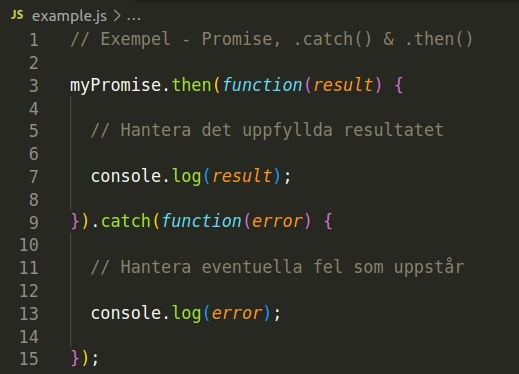
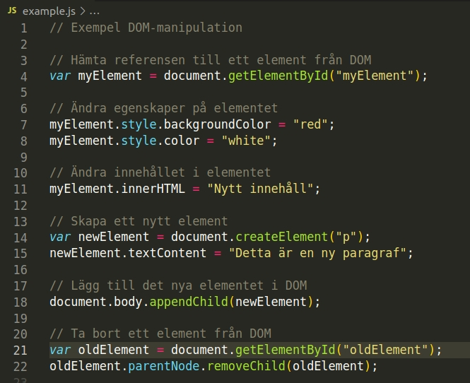
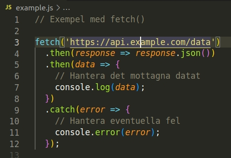
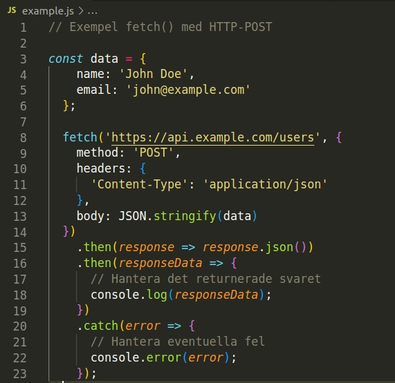
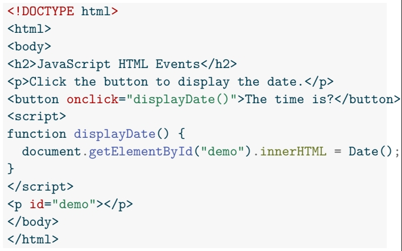
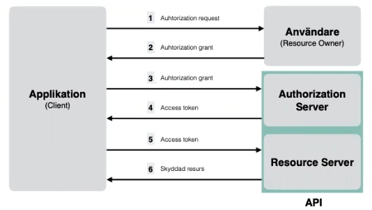
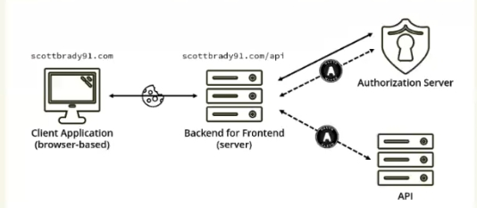

# Teorihandboken - JavaScript (JS)
Studerande: Fredrik Gullin

## JS 1.1 JavaScript / ECMAScript
JavaScript är ett programmeringsspråk som används för att skapa interaktiva och dynamiska webbsidor. Det introducerades av Netscape Communications i december 1995 och har sedan dess blivit ett av de mest populära språken inom webbutveckling.

JavaScript möjliggör att man kan interagera med webbsidor genom att lägga till interaktivitet, dynamiska effekter och manipulation av innehåll. JavaScript används ofta för att skapa funktioner som formulärvalidering, animationer, API-anrop och DOM-manipulation med mera. JavaScript körs direkt i webbläsaren på klientsidan (frontend). JavaScript är tillsammans med HTML och CSS webbens grundläggande byggstenar.

Ett vanligt användningsområde för JavaScript är att bestämma vad som ska hända när en användare interagerar på olika sätt med en webbsida. Detta görs ofta med en så kallad "event listener" vilket innebär att applikationen "lyssnar" på vad användaren gör, t.ex. scrollar på sidan, klickar på ett specifikt fält eller börjar fylla i ett formulär. Detta plockas upp av olika event listeners som därefter genererar en respons. _Mer om detta under punkten "Event handling"..._

**ECMAScript**
ECMAScript är den officiella standarden gör JavaScript som fastställs av ECMA International, en organisation som utvecklar standarder inom information och kommunikationsteknik. ECMAScript definierar språkets syntax, funktioner, objektmodell samt andra detaljer för att säkerställa att JavaScript-implementeringar är kompatibla och konsekventa över olika plattformar och webbläsare.

Nya ECMAScript-versioner släpps löpande med nya funktioner och förbättringar. ECMAScript 6 (även känd som ES6) var en betydande uppdatering som införde viktiga förbättringar och nya funktioner samt blockomfattande deklarationer, arrow-funktioner, klasser, moduler med mera.

De senare versionerna av ECMAScript har också introducerat många användbara funktioner så som _destrukturering, spread-operator, async / await, klassmetoder och moduler_, som förbättrar språkets funktionalitet och möjliggör mer effektiv och läsbar kod.

_Källa: https://www.exsitec.se/blogg/vad-ar-javascript_

_Källa: https://en.wikipedia.org/wiki/ECMAScript_ 

## JS 1.2 JavaScript-ramverk och -bibliotek
Det finns flera ramverk (frameworks) och bibliotek för JavaScript så som Angular, React, Vue, NextJS och Express.js med mera, där Angular, React och Vue är de tre största.

Då vi under utbildningen har fokuserat på Angular, React och Express tänkte jag passa på att kortfattat beskriva dessa.

**Angular**
Angular är ett "open source" ramverk som egentligen är baserat på TypeScript (Typad JavaScript) som utvecklats av Google. Angular används för att bygga kraftfulla och komplexa webbapplikationer. Med Angular kan utvecklare skapa allt från enkla till avanecrade applikationer genom att dra nytta av funktioner som databinding, komponentbaserad arkitektur samt enkel hantering av routing. Angular stöttar även enhetstester. Angular i sig erbjuder även en väldefinierad struktur och "best practice" som hjälper till med skapandet av robusta och skalbara applikationer.

De främsta fördelarna med Angular är strukturen som följer med och att Angular erbjuder en helhetslösning.

**React**
React är ett populärt "open source" ramverk som används för att bygga användargränssnitt i JavaScript. React har utvecklats av Facebook under 2011 och används för att skapa interaktiva och dynamiska webbapplikationer. React använder en komponentbaserad arkitektur, vilket i och för sig inte är unikt för React, men det sätt som det är implementerat på, gör det enkelt att återanvända och underhålla kod. React erbjuder även "virtual DOM" (Document Object Model) för effektiv uppdatering av användargränssnitt. React är också flexibelt och kan användas för att bygga både enkla komponenter och stora applikationer med hjälp av olika verktyg och bibliotek.

De främsta fördelarna med React är möjligheten att dela upp störa projekt i mindre hanterbara delar samt återanvändning av funktioner.

Idag hittar du React.js hos företag som Apple, Paypal, Netflix och såklart Facebook.

**Express**
Express är ett snabbt och minimalistiskt webbramverk för Node.js. Det används för att bygga webbapplikationer och API:er med hjälp av JavaScript eller TypeScript. Express erbjuder enkel hantering av routing, middleware och HTTP-requests. Det ger utvecklare frihet att strukturera och organisera sin kod på ett sätt som passar deras behov. Med stöd för olika tillägg och moduler kan Express utökas med extra funktioner och integreras smidigt med databaser och andra verktyg. Det är ett kraftfullt verktyg för att skapa effektiva och skalbara webbapplikationer.

De främsta fördelarna med Express.js är dess breda utbud av funktioner och verktyg samt att det erbjuder en kraftfull och enkel arkitektur som gör utvecklingen snabb och enkel.

_Källa: https://en.wikipedia.org/wiki/Angular_
_Källa: https://limetta.se/tips-metoder-for-digitala-projekt/vad-ar-react-javascript-ramverk/_
_Källa: https://limetta.se/tips-metoder-for-digitala-projekt/vad-ar-react-javascript-ramverk/_


## JS 1.3 Promises
Promises inom JavaScript är ett koncept för att hantera asynkron kod och hanteringen av resultat från asynkrona operationer som API-calls eller databasförfrågningar. 

_Asynkron kod är kod som körs oberoende av det vanliga programflödet. Istället för att blockera exekveringen av resten av koden och vänta på att en operation ska slutföras, tillåter asynkron kod att andra instruktioner kan köras samtidigt medan den asynkrona operationen pågår i bakgrunden. Det gör det med andra ord möjligt att hantera och svara på händelser och resultat på ett effektivt sätt utan att blockera eller fördröja andra delar av programmet._

Ett promise representerar ett eventuellt resultat av en asynkron operation och kan antingen vara i tillståndet "fullfilled" med ett resultat, eller "rejected" med ett fel.

Promises används för att undvika callback-hell och skapa mer läsbar och hanterbar asynkron kod. Istället för att använda callback funktioner använder man promises och länkar samman operationer med metoder som t.ex. ".then()" och ".catch()".

Man använder metoden ".catch()" för att fånga upp och hantera eventuella fel som kan uppstå under utförandet av de asynkrona funktionerna. Det vill säga när den asynkrona operationen tilldelats statusen "rejected" och retrunerat ett fel. Metoden .catch() tar emot en callback-funktion som kommer köras när promise-objektet blir avvisat. Callback-funktionen får felet som ett argument och kan sedan hantera eller logga felet på ett lämpligt sätt.

Man använder ".then()" metoden för att hantera ett promise som har statusen "fullfilled", det vill säga när den asynkrona funktionen har slutförts och returnerat ett resultat. Metoden .then() tar emot en callback-funktion som kommer att köras när promise-objektet är uppfyllt. Resultatet av promise-objektet skickas in i callback-funktionen som ett argument och kan sedan hantera resultatet och använda det i koden.

**Exempel**



Med promises kan man utföra asynkrona operationer och sedan behandla resultatet (eller felet) när det blir tillgängligt vilket möjliggör mer elegant kodhantering.

_Källa: Föreläsning den 3 november 2022 av Sebastian Lindgren_

Källa: https://developer.mozilla.org/en-US/docs/Web/JavaScript/Reference/Global_Objects/Promise

## JS 1.4 OOP i JavaScript
OOP står för objektorienterad programmering. Inom JavaScript är OOP en programmeringsparadigm där kod och data organiseras i objekt, som kan fungera som byggstenarna för att skapa applikationer, och bygger på koncept som objekt, klasser, arv och inkapsling.

**Konstruktorn och nyckelordet "new"**
I JavaScript skapas objekt genom att använda konstruktorfunktioner. Dessa används för att skapa objekt med gemensamma egenskaper och metoder genom att använda nyckelorder "new" och en funktion som generar en mall för att skapa instanser av objekt.

**Klasser**
Klasser introducerades i ECMAScript 2015 (ES6) och erbjuder en mer formell och strukturerad metod för att skapa objekt i JavaScript. En klass fungerar som "blueprint" för objekt och kan innehålla en konstruktor, metoder och egenskaper. Genom att använda klasser kan man skapa flera objekt av samma typ med gemensamma egenskaper och metoder.

**Arv**
Arv är ett vanligt koncept inom OOP som möjliggör återanvändning av kod genom att låta ett objekt ärva egenskaper och metoder från ett annat objekt. Varje objekt har en prototyp som fungerar som en referens till det objekt som det ärver ifrån. Genom att lägga till egenskaper och metoder till en prototyp kan de delas av alla objekt som ärver från den.

**Inkapsling**
Inkapsling handlar om att skydda och isolera egenskaper och metoder från direkt åtkomst och att dessa ändras. Genom att använda privata variabler och metoder som bara är tillgängliga inom en viss sfär eller ett visst "scope" kan man kontrollera åtkomsten till dessa.

**Fördelar med OOP**
De här är de främsta fördelarna med OOP i JavaScript:

1. Återanvändbarhet
2. Underlättar underhåll av kod
3. Bättre struktur av kod
4. Bättre skalbarhet

Objektorienterad design gör det möjligt att dela upp kod i mindre och mer hanterbara delar.

_Källa: Föreläsning den 2 november 2022 av Sebastian Lindgren_
Källa: https://developer.mozilla.org/en-US/docs/Learn/JavaScript/Objects/Object-oriented_programming

## JS 1.5 DOM-manipulation
DOM står för Document Object Model och är ett programmeringsgränssnitt som representerar och interagerar med HTML-dokumentet i webbläsaren. Allt du ser på skärmen när du surfar med din webbläsare respresenteras av DOM:en. Detta har ungefär samma struktur som ett träd som skapas av webbläsaren och möjliggör enkel åtkomst för manipulation av detta med programmeringsspråk.

När man skapar hemsidor eller applikationer är DOM-manipulation ett av de vanligaste åtagandena. Detta görs genom att använda DOM:en som består av en uppsättning av API:er som används för att kontrollera, manipulera, designa DOM-documentet. 

DOM-manipulation i JavaScript handlar om att ändra och manipulera elementen i innehållet i HTML-dokumentet genom att använda JavaScript-kod.

Genom att använda JavaScript kan man välja specfika HTML-element och därefter ändra deras innehåll och egenskaper, eller lägga till och ta bort element. På detta sätt kan man även hantera "events" och användarinteraktion i webbläsaren.

**Här är ett några exempel på DOM-manipulation i JavaScript**


I exemplet ovan använder vi olika metoder för att manipulera DOM:en:

**document.getElementById()**
Används för att hämta referensen till ett element med dess ID ("myElement"). Sedan ändrar vi elementets egenskaper genom att tilldela nya värden till "style"-attributet. 

**innerHTML**
Används för att ändra innehållet i elementet.

**document.createElement()**
Används för att skapa ett nytt element. Det nya elementet tilldelas därefter egenskaper med ".textContent".

**document.body.appendChild()**
Används för att lägga till ett element i DOM:en. "newElement" läggs då till som barn till "document.body".

**removeChild()**
Används för att ta bort ett element från DOM:en. Först ser vi till att välja "oldElement" med document.getElementById() och därefter ta bort elementet med "oldElement.parentNode.removeChild(oldElement);".

Sammanfattningsvis kan man säga att DOM-manipulation möjliggör dynamisk interaktion och uppdatering av webbsidor i realtid.

_Källa: Föreläsning den 7 november 2022 av Sebastian Lindgren_
Källa: https://developer.mozilla.org/en-US/docs/Learn/JavaScript/Client-side_web_APIs/Manipulating_documents

## JS 1.6 HTTP-requests
Inom JavaScript används HTTP-requests för att kommunicera med webbservern samt att hämta eller skicka data till servern. HTTP-requests möjliggör interaktion med API:er, datahantering och uppdatering av webbsidor i realtid.

För att göra ett HTTP-request i JavaScript finns olika metoder. Den vanligaste metoden för detta är "fetch()"-funktionen.

**Här är ett exempel på en HTTP GET-request med fetch()**


I exemplet används "fetch()" för att göra en GET-request till "https://api.example.com/data". Därefter används ".then()" för att hantera det svar som returneras från servern, eller "catch()" för att hantera eventuella fel som returnerats från servern.

En fördel med att använda fetch()-metoden är att den är inbyggd i moderna webbläsare och därmed inte kräver några externa bibliotek eller ramverk för att fungera. Dessutom stöder fetch() promises, vilket ger en smidigare och mer läsbar kodstruktur genom att använda .then()- och .catch()-metoderna för att hantera responsen och eventuella fel.

HTTP-requests kan också användas för att skicka data till servern, t.ex. genom att använda en HTTP-POST-request.

**POST exempel**


I exemplet ovan skickas data i JSON-format till "https://api.example.com/users" genom en POST-request. "JSON.stringify()" används för att konvertera dataobjektet till en JSON-string. Vi använder även "headers" för att specificera innehållets typ och metod vilket tydliggör att det handlar om en POST-request.

Utöver GET- och POST-requests finns det även andra HTTP-metoder som PUT och DELETE, vilka används för att uppdatera eller ta bort data på servern. Dessa metoder kan vara användbara för att utföra CRUD-operationer (Create, Read, Update, Delete) mot en databas eller annan lagringsplats.

_Källa: Föreläsning den 9 november 2022 av Sebastian Lindgren_
_Källa: https://kinsta.com/knowledgebase/javascript-http-request/_

## JS 1.7 Lexical scope
"Lexical" refererar till definitionen av saker och "scope" refererar till innebörden av område, utrymme eller region.

Lexical scope är ett koncept inom JavaScript som avgör hur variabler hanteras när ett program körs. Det definierar vilka delar av koden som har åtkomst till olika variabler och var dessa variabler är tillgänliga.

I Lexical scope avgörs variabelåtkomsten baserat på var en variabel är deklarerad i källkoden. Det innebär att variabler som deklareras inuti en funktion är tillgängliga inom den funktionen och alla dess inre funktioner, men inte utanför dem. Det innebär att Lexical scope bildar en hierarki av scopes där inre funktioner har åtkomst till variabler i sina omslutande funktioner.

En viktig aspekt av detta är att åtkomsten till en variabel bestäms när den deklareras och inte när programmet körs (exekveringstid). Det innebär att när en funktion skapas, så skapas även dess scope med alla variabler som är tillgängliga för den. Detta gäller även om funktionen i sig senare körs på en annan plats. Funktionen behåller då variabler som deklarerats i dess ursprungliga scope.

**Ett scope kan se ut på följande sätt:**

function outer() {
    const x = 10;

    function inner() {
        const y = 20;
        console.log(x + y); // Skriver ut 30
    }

    inner();
}

outer();

I den yttre funktionen har vi deklarerat variabeln "x" och i den inre funktionen deklarerar vi variabeln "y". **Den inre funktionen har åtkomst till både x och y då eftersom de ligger inom den yttre funktionens scope. Medan den yttre funktionen endast har åtkomst till x.**

_Källa: https://www.freecodecamp.org/news/javascript-lexical-scope-tutorial/_

## JS 1.8 Event handling
En eventhandler är ett kodblock som körs när ett event inträffar. Dessa kan vara definierade av utvecklarna som skriver applikationen.

**En eventhandler kan se ut på följande sätt:**


Som min extraordinärt bra och coola lärare en gång sa. - _"Det kan vara trevligt att programatiskt lägga till en event handler. Det kan även vara trevligt att ha flera events tillagda till samma element. För detta ändamål används eventlisteners."_

Med en eventlistener kan man lägga till events till hela HTML-DOM objektet (inklusive Window). Därav kan man ha flera event av samma typ på ett element. En eventlistener lyssnar på events och väntar på att något ska hända, t.ex. ett klick, någon scrollar eller trycker på en tangent, börjar fylla i ett formulär, hovrar över en bild etc.

**För att lägga till en eventlistener använder man följande syntax:**

element.addEventListener("mouseover", myFunction);

Det finns olika sorters eventlisteners. Här är några fler exempel:

element.addEventListener("mouseover", myFunction);

element.addEventListener("click", mySecondFunction);

element.addEventListener("mouseout", myThirdFunction);

Event handling används också för att hantera bubbling och capture i händelseflödet. Bubbling innebär att när en händelse inträffar på ett element, bubblar den upp genom elementets föräldrar i DOM-trädet. Capture är motsatsen, där händelsen först fångas av det yttersta elementet och sedan propagaterar nedåt genom elementens föräldrar.

Sammanfattningsvis är event handling en viktig del av JavaScript-programmering för att skapa interaktiva och responsiva webbsidor och applikationer. Genom att registrera event handlers och lyssna på olika händelser kan man reagera på användarens interaktion och utföra olika åtgärder baserat på dessa händelser. Event handling ger en flexibel och kraftfull mekanism för att skapa dynamiska och engagerande användargränssnitt.

_Källa: Föreläsning den 7 november 2022 av Sebastian Lindgren_
_Källa: https://javascript.info/bubbling-and-capturing_

## JS 1.9 Prototype inheritance
För att vår kod ska vara så "DRY" (Don't Repeat Yourself) som möjligt kan vi låta objekt ärva egenskaper och metoder från andra objekt.

**Exempel**
```
const Animal = function (sound) {
    this.makeSound = function () {
        console.log(sound);
    }
};

const Dog = function (name, breed) {
    this.name = name;
    this.breed = breed;
};

Dog.prototype = new Animal ('woof');
const dog = new Dog('Lassie', 'Collie');

dog.makeSound();
```
I det ovanstående exemplet kan vi se hur "Dog" använder funktionen makeSound() från Animal.

JavaScript är ett prototypbaserat språk. Detta innebär att alla objekt kan ha ett prototyp-objekt. Ett prototyp-objekt kan beskrivas som en mall som man kan använda när man skapar nya objekt. De nya objekten kan då ärva egenskaper och metoder från prototyp-objektet. I JavaScript ärver objekt egenskaper från "förälder-objektet".

**Exempel**
```
function Person(name) {
    this.name = name;
    this.greeting = function () {
        alert("Hi! I'm" + this.name + ".");
    };
}

let person3 = new Person("Bjorn");
person3.greeting();
```
I ovanstående exempel ser vi hur persona3 ärver metoden greeting och egenskapen name från Person och får därmed åtkomst till- och kan använda dessa. Person är således mall (prototyp) för person3.

Det finns två huvudsakliga koncept inom prototype inheritance:

1. Varje funktion i JavaScript har en prototype property som är tom från början. Denna används huvudsakligen för arv, man lägger således till metoder och egenskaper på en funktions prototyp-property för att göra metoderna tillgängliga för eventuella instanser.

2. Prototype attribute ger information om ett objekts förälder, med andra ord objektet som det nya objektet ärver sina egenskaper från. Förälder objektet kallas ofta för prototype object.

_Källa: Föreläsning den 31 oktober 2022 av Sebastian Lindgren_

## JS 1.10 Higher-order functions
I JavaScript kan funktioner tilldelas till variabler på samma sätt som t.ex. en string eller en array. Detta möjliggör att de kan skickas in i andra funktioner som parametrar (eller returneras av en funktion). En "higher-order function" är en funktion som godtar en funktion som parameter, eller returnerar en funktion.

Det finns flera olika typer av higher-order functions som t.ex. map() och reduce().

**Hur fungerar en higher-order function**
Låt oss säga att vi vill skapa en funktion som räknar ut arean och diametern på en cirkel.

För att lösa detta med en higher-order function kan ma göra på följande sätt:

**Exempel**
```
const radius = [1, 2, 3];

// Logik för att räkna ut area

const area = function(radius) {
    return Math.PI * radius * radius;
}

// Logik för att räkna ut diameter

const diameter = function(radius) {
    return 2 * radius;
}

// En återanvändbar funktion som räknar ut area, diameter etc...

const calculate = function(radius, logic) {
    const output = [];
    for (let i = 0; i < radius.length; i++) {
        output.push(logic(radius[i]))
    }
    return output;
}

console.log(calculate(radius, area));
console.log(calculate(radius, diameter));
```
Som framgår av exemplet ovan har vi endast skrivit en funktion, calculate() som löser problemet. Koden i exemplet använder en higher-order function som är kortfattad och modulär. Varje funktion löser sin uppgift och vi håller koden DRY.

Om vi i detta scenario skulle vilja göra en funktion som räknarut omkretsen på en cirkel så skulle vi kunna skriva logiken och skicka in den i vår calculate() funktion. Därmed är calculate() återanvändbar.

Higher-order function kan användas på en mängd olika sätt.

När man jobbar med arrays kan man använda sig av map(), reduce(), filter() och sort() för att manipulera och omvandla data i en array.

När man jobbar med objekt kan man använda Object.entries() funktionen för att skapa en ny array av ett objekt.

När man jobbar med funktioner kan man använda compose() funktionen för att skapa mer komplexa funktioner av enklare funktioner.

_Källa: https://www.freecodecamp.org/news/higher-order-functions-in-javascript-explained/_

## JS 1.11 Single-thread programming
JavaScript är ett "Single-threaded" programmeringsspråk, vilket innebär att endast en rad kod kan köras åt gången. Att JavaScript är ett single-threaded språk beror på att det tidigare endast var ett scriptspråk för webbläsare som togs fram för att hantera en enskild användare med ett enskilt fönster i en webbläsare, vilket innebar att det inte fanns behov av "multi-treading".

I praktiken innebär detta att med JavaScript-kod körs en instruktion i taget, och när instruktionen är klar går programmet vidare till nästa instruktion. Detta sker i en linjär ordning, från början till slut, och ingen annan kod kan exekveras samtidigt.

**Problem**
Då JavaScript är single-threaded kan bara en sak hända åt gången. Om en instruktion tar lång tid att köra, till exempel en tung beräkning eller en långvarig nätverksbegäran, kommer det att blockera resten av koden från att exekveras under den tiden. Detta kan leda till en upplevd "frysning" av webbläsaren eller att användargränssnittet inte svarar.

**Asynkron programmering**
För att hantera detta och förhindra blockering kan JavaScript använda tekniker som asynkron programmering och använda callbacks, promises eller async/await för att schemalägga och hantera icke-blockerande operationer. Detta möjliggör att andra instruktioner kan fortsätta att exekveras medan en långvarig operation pågår, och resultatet av den operationen kan hanteras senare när det är klart.

Ett exempel på när detta skulle kunna användas är när man ska hämta något från ett API. Då skapar man en så kallad asynkron funktion, vilket kan se ut på följande sätt:

**Exempel**
```
// Async function

const myFetch = async () => {
    try {
        const URL = 'https://api.example.com/data';

        const response = await fetch(URL);
        
        // Felhantering

        if (!response.ok) {
            throw new Error('Hämtning misslyckades');
        }
        const data = await response.json();
        
        // Gör något med datan

        return data;
    } catch (error) {
        console.log(error);
        
        // Hantera felet på ett lämpligt sätt
    }
}
```

I exemplet ovan skulle funktionen myFetch pausas vid await och därmed inte blockera programmet som kan fortsätta exekvera resterande kod medan myFetch väntar på att bli fullfilled eller rejected.

_Källa: https://medium.com/swlh/what-does-it-mean-by-javascript-is-single-threaded-language-f4130645d8a9_

## JS 1.12 OAuth från frontend
OAuth står för "Open Authorization" och är ett öppet standard protokoll som möjliggör tilldelande av rättigheter till användare så att det kan komma åt resurser på servern (eng. "resource server").

Inom webbutveckling används OAuth vanligtvis för att möjliggöra autentisering och auktorisering mellan en frontend applikation (client) och ett backend API (resource server).

* **Autentisering** - (eng. Authentication) är en process för att avgöra huruvida någon är den de utger sig för att vara
* **Auktorisering** - (eng. Authorization) är en process för att avgöra vad en autentiserad entitet har rättigheter till att göra

I ett mindre system skulle detta kunna fungera genom att man i backend har en lista med användare som innehar en specifik "roll" som t.ex. "användare", "admin" eller "superadmin". Användarens tilldelade roll kan därefter tilldelas olika grad av rättigheter som ger åtkomst till olika nivåer av vad som kan göra i t.ex. backend / serversidan eller en databas. Vanligast är dock att man har ett booleanskt värde som visar om en avnändare är "admin" eller inte.

Ett av de säkrare sätten att göra detta är genom att använda _OAuth2_. Som innebär att man låter någon typ av tredjeparts system utföra autentiseringen och auktoriseringen. Det finns olika implemmenteringar av inlogning och genom att använda t.ex. ett större företag som sin OAuth partner, som t.ex. Google eller Facebook är att det blir väldigt säkert. Detta då dessa företag investerat åtskilliga miljarder dollar för att se till att deras servrar håller högsta möjliga säkerhet. Detta är därför den främsta fördelen med att använda OAuth2 / tredjeparts system (third party Auth providers). Nackdelen är att det vid en större mängd inloggningar per månad (+50 000 aktiva användare) kan medföra kostnader. Kostnaderna är dock relativt låga.

OAuth kan kopplas i enbart frontend, enbart backend eller någon kombination. När man endast kopplar OAuth i enbart frontend så behöver applikationen inte spara saker i backend. Användarens uppgifter som lösenord etc är sparade på Googles eller Facebooks server / i deras databas. Därefter kan man genom auktorisering och OAuth (scope) ge rättigheter för användaren visa t.ex. status meddelanden från Facebook.

De skyddade användaruppgifterna lagras således på resursservern. Där sker även auktorisering och verifiering av användarens identitet. Därefter tilldelas applikationen med så kallade access tokens.


_Från perspektivet som utvecklare är det API:et som representerar båda dessa roller._

**Funktionalitet**
Hur OAuth fungerar kan enkelt beskrivas med nedanstående bild.



**Säkerhet**
Det hittills absolut säkraste sättet att göra detta är att anvädnda en "backend for frontend" lösning där en backend gör OAuth-calls och returnerar en cookie med ett bearer-token. Man ser även till att det inte finns någon åtkomst till applikationens API från frontend utan att detta sköts helt via backend. Detta är säkrare då detta mellansteg minimerar risken för att en användare injekterar JavaScript i frontend i t.ex. en post för att komma åt andra användares inloggingsuppgiter. Genom att sköta allt det här på server-sidan är detta inte möjligt då det läggs på lager av säkerhet som avväpnar ett JavaSCript genom "strip tags" eller "@CSRF". Man kan bygga sin applikation så alla anrop till OAuth med mera kommer ligga på server samt att servern inte går att "läsa" utifrån.



En nackdel med detta är att det är långsammare.

_Källa: Föreläsning den 22 maj 2023 av Sebastian Lindgren_

## JS 1.13 Websockets
Websockets möjliggör en tvåvägsförbindelse mellan klient (vanligtvis en webbläsare) och server, en kontinuerlig koppling som pågår tills den stängs av. Det bästa med websockets är att det erbjuder en möjlighet att skicka information omedelbart mellan klient och server.

Till skillnad från traditionella HTTP-requests som kräver att klienten initierar kommunikationen med servern för varje request, tillåter websockets en kontinuerlig, interaktiv kommunikation mellan klienten och servern.

Websockets erbjuder ett flertal fördela för webbutvecklare:

1. Real-time updates: Websockets möjliggör omedelbara uppdateringar i realtid från servern utan att klienten behöver skicka upprepade requests. Detta är framförallt en fördel när man utvecklar applikationer som kräver realtids uppdateringar som t.ex. ett chatprogram, verktyg som används vid handel på börsen, verktyg för att sammarbeta i t.ex. ett dokument eller realtids gaming.

2. Effektivitet: Websockets minskar omkostnaderna för HTTP-förfrågningar. När den första anslutningen upprättats kan efterförljande meddelanden skickas fram och tillbaka mellan klient och server utan behov av upprepade HTTP-requests. Detta ger lägre latens och minskad nätverkstrafik.

3. Tvåvägskommunikation - Websockets stödjer tvåvägskommunikation, vilket tillåter både klienten och servern att skicka meddelanden mellan varandra när som helt så länge uppkopplingen är upprättad. Detta möjliggör interaktiva egenskaper då servern kan "pusha" uppdateringar till klienten och klienten kan trigga olika events på servern utan att skicka ett request.

4. Kompatibilitet: Websockets har en bred kompatibilitet och fungerar på de flesta webläsarna, vilket leder till ett pålitligt val när man vill implementera realtids funktionalitet i en webb-applikation.

För att använda websockets som webb-utvecklare brukar man vanligtvis använda ett websocket-API på klientsidan och implementerar websocket-hantering på serversidan. Klienten upprättar en websocket-anslutning genom att skicka en uppdateringsbegäran till servern, och vid lyckad anslutning kan klienten och servern utbyta meddelanden i båda riktningarna.


_En nackdel med detta är att man inte kan serva lika många användare samtidigt som t.ex. som man kan med vanliga HTTP-requests._

_Källa: https://www.wallarm.com/what/a-simple-explanation-of-what-a-websocket-is_
_Källa: Föreläsning den 17 maj 2023 av Sebastian Lindgren_