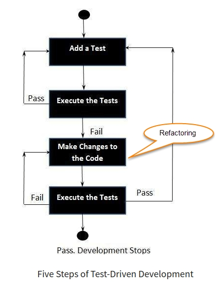

# Teorihandboken - Programmeringsmetodik (PG)
Studerande: Fredrik Gullin

## PG 1.1 Versionshantering (Git)
För att förstå vad *versionshantering* och *Git* är måste vi först förstå vad ett versionshanteringssystem är.

Ett versionshanteringssystem (*VCS / ”version control system”*) är ett system som effektivt håller reda på ändringar i en eller flera filer över tid så att du kan återskapa specifika versioner vid en senare tidpunkt.

Ett *VCS* tillåter dig att återskapa valda filer eller hela projekt till ett tidigare tillstånd, jämföra ändringar över tid, samt spåra vem som gjort någon förändring och när förändringen gjordes. Om förändringen orsakat ett problem kan detta snabbt hittas och åtgärdas med hjälp av systemet. Ett *VCS* är också ett bra sätt att försäkra sig om att data inte går förlorad då man generellt kan återställa allt på ett enkelt sätt.

Det finns olika typer av versionshanteringssystem. I kommande avsnitt ska vi ta en närmare titt på några av dessa och deras för- och nackdelar.

**Lokala Versionshanteringssystem**
Precis som namnet avslöjar är ett lokalt versionshanteringssystem ett system som lagrar informationen om versioner och förändringar över tid i en lokal databas på användarens dator. En fördel är att systemet givetvis kan användas för att jämföra skillnader mellan versioner (*patchar*) men nackdelen med detta system är att det är felkänsligt. Om hårddisken i användarens dator skulle gå sönder så går hela projektets data förlorad. Om det är flera personer som jobbar i samma projekt men lokalt på sina egna datorer är det även svårt att hålla reda på vem som gör vad och mer komplicerat att få de olika delarna att fungera som en helhet.

**Centraliserade Versionshanteringssystem**
Centrala versionshanteringssystem (*CVCS*) utvecklades för att underlätta samarbeten där flera personer är med och utvecklar samma projekt. Det centrerade systemet har en enda server som innehåller alla versionshanterade filer och ett antal användare (*klienter*) som ”checkar ut” filer från den centrala servern. Under många år var detta det vanligaste sättet att versionshantera.

Ett *CVCS* har flera fördelar över lokala VCS då det till exempel gör det möjligt för deltagarna i ett projekt att bli medvetna om vad alla gör i projektet. Administratörer kan ha detaljerad kontroll över vem som kan göra vad sant att det är betydligt enklare att administrera ett centralt system än att hantera lokala databaser på varje enskild användares dator.

Nackdelen med detta system är användarnas beroende av att servern fungerar. Om servern slutar fungera och ligger nere i 1 timme så innebär detta att ingen kan arbeta med projektet under 1 timme. Om serverns hårddisk av någon anledning skulle gå sönder och datan inte går att återställa så går hela projektets historik förlorad (bortsett från datan som finns sparad lokalt på användarnas datorer). När man sparar all data på ett enda ställe riskerar man att förlora allt.

**Distribuerade Versionshanteringssystem**
Ett distribuerat versionshanteringssystem (*DVCS*) är ett system där användarna inte checkar ut den senaste versionen av filerna, utan speglar istället hela databasen (inklusive historik) som sparas lokalt på användarnas datorer. Fördelen med detta är att om en server skulle sluta fungera och datan förloras så kan vem som helst av användarna ladda upp sin spegelbild av projektet för att återställa den. Varje spegelbild (*klon*) är i själva verket en fullständig säkerhetskopia av all data.

Med ett *DVCS* kan användarna, genom att ha flera fjärrförvar, samarbeta med flera personer på olika sätt inom samma projekt, och gör det möjligt att ha flera olika arbetsflöden, vilket inte är möjligt med CVCS.

**Git**
Git är ett DVCS som kom till världen 2005 och uppfyller sina ursprungliga mål om att vara lättanvänt, förbluffande snabbt, väldigt effektivt med stora projekt och ett otroligt bra system för icke-linjär utveckling.

**Snapshots**
Konceptuellt sparar andra versionshanteringssystem information som en lista av filändringar, det vill säga en uppsättning filer och ändringarna som gjorts i varje fil över tid (även kallat deltabaserad versionshantering).

Git skiljer sig från övriga versionshanteringssystem och lagrar sin data som en serie ögonblicksbilder (snapshots) av ett miniatyrfilsystem. Varje gång du sparar en version eller sparar tillståndet i ditt projekt i Git så tas en bild över hur alla dina filer ser ut för ögonblicket och en referens till varje ögonblicksbild sparas. För att effektivisera sparas inte en fil på nytt ifall den inte har ändrats, utan endast en länk till föregående identiska fil som redan lagrats. Man kan tänka på data som Git hanterar som en ström av ögonblicksbilder.

De flesta operationerna i git görs lokalt och behöver endast lokala filer och resurser för att fungera (till skillnad från centraliserade versionshanteringssystem där de flesta operationer är beroende av nätverksuppkoppling för att fungera, vilket även leder till fördröjning). Då hela historiken av ett projekt sparas lokalt på användarens dator upplevs arbete i Git som mycket snabbt och effektivt. Då nästan all data sparas lokalt kan man i praktiken göra det mesta även utan internetuppkoppling.

**Integritet**
Allt i Git beräknas som en _checksumma_ innan det lagras och sedan refererar men till den checksumma. Detta innebär att det är omöjligt att ändra innehållet i någon fil eller katalog utan att Git känner till det. Denna funktion är inbyggd i Git på de lägsta nivåerna och är fundamentalt för dess filosofi. Du kan inte tappa information på vägen eller få en korrupt fil utan att Git kan detektera det.

Mekanismen som Git använder för att beräkna checksumman kallas för en SHA-1 hash. Det är en fyrtio lång teckensträng som består av hexadecimala tecken (0-9 och a -f) och beräknas baserat på innehållet i en fil eller katalogstruktur i Git.

När man utför en operation i Git resulterar detta alltid i att något läggs till i databasen. Det är svårt att få systemet att göra någon som inte kan ångras i efterhand eller att data på något sätt går förlorad. Så länge en ögonblicksbild har sparats kan man experimentera fritt utan rädsla att förstöra något.

Git kan användas oftast med en linux-terminal (eller med Git Bash för Windows) där man kan ange kommandon för att få Git att utföra det man önskar. Det är även möjligt att installera en extension i Visual Code som ger en del genvägar för att få Git att utföra vissa operationer.

För att se några exempel på grundläggande kommandon i git terminalen kan man besöka denna sida: [Atlassian - Git commands](https://www.atlassian.com/git/glossary).

__När man arbetar i grupp med större projekt kan det vara bra att ha en strategi för versionshantering. En populär strategi är att arbeta med "git flow". Detta går ut på att man skapar en branch som kallas main som är för produktion, en branch för utveckling som kallas develop och en branch för varje feature man arbetar med, en så kallad "feature branch". En feature kan t. ex. vara att skapa en funktion för något eller någon komponent i projektet. När denna är klar pushas denna upp till repot av utvecklaren som skapat branchen. Därefter görs ett "pull request" där utvecklaren ber någon av kollegorna att inspektera koden och om det finns några problem eller konflikter med övrig kod (en så kallad merge conflict) kan detta lösas innan featuren blir mergead in i develop branchen där projektet existerar i utvecklingsstadie. På detta sätt kan man se till att gruppmedlemmarna inte skriver över varandras kod när de mergar sina tillägg. När develop branchen är redo att mergas med main så uppdateras eller deployas själva applikationen i produktionsläge. Git flow är mycket effektivt och användbart.__

_Källa: https://git-scm.com/book/sv/v2/Kom-ig%C3%A5ng-Om-versionshantering_

## PG 1.2 Benchmarking
**Affärsmässigt**
Benchmarking inom handel är en process för att mäta prestanda för ett företags produkter, tjänster eller processer mot de från ett annat företag som anses vara bäst i branchen. Poängen med detta är att identifiera interna förbättringsmöjligheter.

Genom att studera en produkt som levererar överlägsen prestanda och analysera vad händer för att uppnå detta, så kan man jämföra dessa processer med hur ens egen produkt är uppbyggd och fungerar och på så sätt förstå vilka förbättringar man behöver implementera som kan resultera i betydande förbättringar.

Det kan t.ex. innebära att man justerar en applikations funktioner för att bättre matcha en konkurrerande produkts prestanda. Det kan även betyda att man ändrar omfattningen av tjänster som är kopplade till applikationen och logistiken runt denna.

**Inom programmering**
Inom programmering kan benchmarking beskrivas som en process som har för avsikt att mäta prestandan av ett system, en algoritm eller hårdvara. Det involverar att genomföra tester eller experiment för att samla data om olika mått, så som exekveringstid, hur mycket minne som används, hur mycket processorkraft som går åt eller andra prestandaorienterade faktorer.

Målet med benchmarking inom programmering är således (precis som ovan) att jämföra och förbättra. Mätningarna kan användas för att jämföra olika implementeringar, konfigurationer eller optimeringar. Genom att analysera benchmarkingresultaten kan utvecklare identifiera flaskhalsar, optimera kod, finjustera systemkonfigurationer eller fatta välgrundade beslut om att välja den mest effektiva lösningen.

Benchmarking är ett viktigt verktyg inom programmering eftersom det tillåter utvecklare att fatta välgrundade beslut, vilket i sin tur leder till mer effektiva lösningar.

_Källa: https://www.shopify.com/blog/what-is-benchmarking_

## PG 1.3 Testdriven utveckling
Testdriven utveckling (även känt som TDD) är ett tillvägagångssätt inom mjukvaruutveckling där tester tas fram för att specificera och validera vad koden kommer att göra. Enkelt uttryckt skapas och testas olika scenarion för varje funktionalitet. Om koden inte klarar testet skrivs den om för att klara testet och för att göra koden enkel och buggfri.

Testdriven utveckling börjar med att man först skapar tester för varje liten funktionalitet i en applikation. TDD-ramverken instruerar utvecklare att skriva ny kod endast om ett automatiserat test har misslyckats. Detta bidrar till att hålla koden "DRY", med andra ord, att undvika upprepningar.

Det enkla konceptet med testdriven utveckling är att skriva och korrigera de misslyckade testerna innan man skriver ny kod (det vill säga före själva utvecklingsfasen). Detta bidrar till att undvika duplicering av kod eftersom man skriver en liten mängd kod åt gången för att klara de tester man tagit fram. _Tester är egentligen inget annat än krav och villkor som måste testas för att säkerställa att de uppfylls._

**Hur går ett TDD-test till?**
Följande steg visa hur man utför ett TDD-test:

1. Ta fram / lägg till ett eller flera test
2. Kör alla tester och se om något misslyckas
3. Skriv ny kod
4. Kör tester på nytt och korrigera koden
5. uppreapa tills önskat resultat har uppnåtts

**Några förtydliganden om TDD**
* TDD-metoden handlar varken om "testning" eller "design"
* TDD betyder inte "skriv några av testerna och bygg sedan ett system som klarar testerna"
* TDD betyder inte "gör massor av tester"

_Källa: https://www.guru99.com/test-driven-development.html_

## PG 1.4 Deploy och staging
**Deploy**
Programvarudistribution eller "deployment" som det också kallas inkluderar alla steg, processer och aktiviteter som krävs för att göra ett programsystem eller en uppdatering tillgänglig för dess avsedda användare. Idag distribuerar de flesta IT-organisationer och mjukvaruutvecklare programuppdateringar, patchar och nya applikationer med en kombination av manuella och automatiserade processer. Några av de viktigaste aktiviteterna för programdistribution är programutgivning, installation, testning, distribution och prestandaövervakning.

**Kortfattat**
* Deployment syftar till processen att få en applikation att fungera på en målenhet som t.ex. en testserver, produktionsmiljö eller en användares dator eller mobiltelefon.
* Mjukvaruutvecklare har skapat arbetsflöden som möjliggör snabbare och mer frekvent distribution av programuppdateringar till produktionsmiljön där de kan nås av användare.

Deployment är en av de viktigaste aspekterna av mjukvaruutvecklingsprocessen. Implementering är metoden som applikationer, moduler, uppdateringar och patchar levereras, av utvecklare till användare. Metoden används av utvecklare för att bygga, testa och deploya ny kod påverkar hur snabbt en produkt kan anpassas efter förändringar i kundernas preferenser eller krav.

Team av utvecklare som effektiviserar denna process kan svara snabbare på kundernas efterfrågan med nya uppdateringar och leverera nya funktioner oftare för att öka kundnöjdheten, tillfredsställa användarnas behov och därmed dra fördel av ekonomiska möjligheter.

_Ett exempel på en sådan metod kan vara att merga "develop" branchen till "main" branchen i git-flow._

**Staging**
Staging kan beskrivas som en kopia av din produktionsmiljö (din nuvarande live-webbsida) på en lokal / privat server. Det här är en säker plats som tillåter utvecklare att testa alla ändringar, större eller mindre, som man planerar att implementera i en säker miljö, vilket förhindrar oväntade fel i produktionsmiljön.

Med andra ord är staging en miljö för att testa en webb-applikations ändringar innan de går "live" (produktion). Staging gör att vi kan härma produktionsmiljön, testa applikationen och säkra den bakom kulisserna så att kunden och utvecklarna kan granska och godkänna eventuella tillägg till applikationen. Staging är viktigt ur både en kundrelationssynpunkt och ett ingenjörsperspektiv.

_Ett exempel på detta kan vara t.ex. "develop" branchen när man använder git-flow._

_Källa: https://www.sumologic.com/glossary/software-deployment/_
_Källa: https://www.commonplaces.com/blog/web-development-what-is-staging/_

## PG 1.5 Debugging
Debugging (felsökning) är processen att lokalisera och ta bort kodningsfel i ett datorprogram / applikation. Inom informationsteknologi och teknik är ordet "bugg" en synonym till ordet "fel". Målet med debugging är att identifiera och korrigera ett fels grundorsak.

Debugging är en viktig del av utvecklingsprocessen och ironiskt not kan testning för att fastställa och eliminera förekomsten av buggar ta lika mycket tid som att skriva själva koden. Felsökningsprocessen består av att hitta orsaken till ett fel och åtgärda det. Under denna process, som kan utföras manuellt eller automatiserat med verktyg, kommer utvecklarna leta efter syntaxfel, skrivfel, logiska fel och implementeringsfel.

Logiska fel kan vara svåra att korrigera då det inte alltid är uppenbart vad som orsakar problemet. Detta kan därför ta lång tid att lösa.

Programvaruverktyg för debugging inkluderar stöd för mjukvaruutvecklingskit (SDK) för specifika programmeringsspråk, varningsfunktioner och användargränssnitt (dashboard) som möjliggör för utvecklare att gå på djupet för att reda ut orsakerna till specifika fel.

VS-code har en inbyggd debugger där utvecklare t.ex. kan undersöka exakt vad som händer, rad för rad, vid exekvering. Detta kan bland annat hjälpa till att hitta orsaken till ett logiskt fel.

_Källa: https://www.techopedia.com/definition/16373/debugging_

## PG 1.6 Dokumentation
All skriven text, illustrationer eller video som beskriver ett program eller en applikation kan ses som dokumentation för / till programvaran i fråga, ett så kallat programvarudokument.

Användare av dokumentationen kan vara vem som helst, från programmerare, systemanalytiker eller administratör till slutanvändare. Vid olika utvecklingsstadier kan flera dokument skapas för olika användare. Faktum är att dokumentationen av programvaran / applikationen är en mycket väsentlig del av applikationens övergripande utvecklingsprocess.

I modulär programmering blir dokumentation ännu viktigare eftersom olika moduler av programvaran utvecklas av olika team. Om någon annan än de som ingår i utvecklingsteamet behöver förstå hur en modul är uppbyggd, kommer bra och detaljerad dokumentation att underlätta enormt.

**Riktlinjer**
Detta är några riktlinjer för att skriva bra dokumentation:

* Dokumentation bör utgå från läsarens perspektiv
* Dokumentation ska vara konsekvent och entydig
* Dokumentation bör inte innehålla upprepningar
* Man bör använda sig utav branchstandarder när man skriver dokumentation
* Dokumentationen bör alltid uppdateras vid eventuella förändringar
* Alla inaktuella dokument bör fasas ut efter vederbörlig registrering av utfasning

**Fördelar med dokumentation**
Detta är några fördelar med dokumentation:

1. Dokumentation håller reda alla delar av ett program eller en applikation
2. Det är lättare att underhålla en applikation som är väldokumenterad
3. Andra programmerare än själva utvecklaren kan förstå alla aspekter av applikationen
4. Dokumentation förbättrar den övergripande kvalitén på applikationen
5. Hjälper användarna av applikationen
6. Säkerställer kunskapsdecentralisering, minskar kostnader och ansträngningar om användare / utvecklare plötsligt lämnar systemet

**Typer av dokumentation**
Här följer några förslag på typer av dokumentation:

* En README.md - kan innehålla information om hur applikationen används, mål och syfte och information till utvecklare som eventuellt ska jobba vidare med applikationen.
* Användarmanual - innehåller beskrivning om hur appen används av slutanvändarna.
* Operationsmanual - listar och beskriver alla operationer som utförs och deras inbördes beroenden.
* Designdokument - ger en översikt över applikationen och beskriver designelement i detalj.
* Kravspecifikation - listar alla krav i ställts för applikationen samt en analys av genomförbarhet.
* Teknisk dokumentation - dokumentation av faktiska programmeringskomponenter som algoritmer, flödesscheman, programkoder, funktionsmoduler etc.

_Även välkommenterad kod kan vara nyttigt._

Källa: https://www.tutorialspoint.com/programming_methodologies/programming_methodologies_program_documentation.htm

## PG 1.7 Struktur av kod i projekt
I praktiska termer betyder "struktur" att man strävar efter att hålla en ren kod där logiken är tydlig och där även mappar och filer är välorganiserade inom projektets filsystem. När vi diskuterar "struktur" syftar vi på de beslut som fattas för att bäst uppnå målet med projektet. Det handlar om att noggrant överväga hur man kan dra nytta av språkets funktioner för att skriva kod som är både ren och effektiv. Konkret innebär "struktur" att skapa kod där logiken och beroendena är tydliga, samtidigt som filer och mappar är ordnade på ett sätt som främjar överskådlighet och effektivitet inom filsystemet.

Genom att besvara frågor som vilka funktioner som bör finnas i vilka moduler, hur data ska flöda genom projektet, och vilka egenskaper och funktioner som kan grupperas och isoleras, kan man påbörja planeringen av hur den färdiga produkten kommer att se ut. Genom att ha en tydlig struktur i projektet blir det lättare att navigera, underhålla och vidareutveckla koden. Dessutom bidrar en välorganiserad struktur till ökad samarbetsförmåga inom utvecklingsteamet och effektivare hantering av projektet som helhet.

**Varför är struktur viktigt?**
Struktur är viktig inom programmering av flera anledningar. För det första hjälper det till att skapa en ren och tydlig kodbas som är lätt att förstå och underhålla. En välstrukturerad kod gör det också enklare att återanvända och testa olika delar av koden separat. Struktur underlättar också samarbete inom utvecklingsteam genom att främja en enhetlig kodstil och organisering av projektet. Dessutom bidrar struktur till skalbarhet, vilket innebär att koden kan växa och utvecklas utan att förlora översikt eller bli svårhanterlig. En bra struktur hjälper även till att minimera fel och underlätta felsökning genom att göra det lättare att lokalisera och isolera problemområden. Sammantaget främjar struktur i programmeringsefterlevnad, effektivitet och underlättar hållbarheten och framgången hos ett projekt.

_Källa: https://docs.python-guide.org/writing/structure/_

## PG 1.8 Automatisering av arbetsflöde
Arbetsflödesautomatisering är en metod där programvara används för att slutföra uppgifter och aktiviteter utan behov av manuell inmatning eller interaktion från människor. Det är ett kraftfullt verktyg som syftar till att göra arbete snabbare, enklare och mer konsekvent genom att ta över repetitiva och tidskrävande processer.

Genom att automatisera arbetsflöden kan företag effektivisera sina verksamheter och frigöra tid och resurser för mer värdeskapande arbetsuppgifter. Genom att identifiera rutinmässiga och standardiserade uppgifter inom en organisation kan man utforma automatiserade processer för att hantera dem. Det kan vara allt från att automatisera datainmatning och filhantering till att schemalägga och distribuera rapporter eller att automatiskt skicka påminnelser och notifieringar.

En viktig aspekt av arbetsflödesautomatisering är att det minskar risken för mänskliga fel och ökar konsekvensen och noggrannheten i utförandet av arbetsuppgifter. Genom att använda regelbaserade eller logikbaserade automatiseringsverktyg kan man säkerställa att arbetsflöden följer fördefinierade regler och riktlinjer. Detta minskar risken för missförstånd eller glömska som kan uppstå vid manuell hantering.

Arbetsflödesautomatisering kan också bidra till bättre samarbete och kommunikation inom en organisation. Genom att automatisera processer kan olika avdelningar och team enkelt dela information och samarbeta i realtid. Till exempel kan en automatiserad arbetsflöde hantera och flytta data mellan olika system eller plattformar, vilket möjliggör sömlös integration och informationsutbyte.

Det är viktigt att notera att arbetsflödesautomatisering inte syftar till att ersätta människor, utan snarare att befria dem från repetitiva och tidskrävande uppgifter. Det frigör tid och energi som kan användas för mer kreativa och strategiska uppgifter som kräver mänskligt omdöme och beslutsfattande.

_Källa: https://www.pipefy.com/blog/what-is-workflow-automation/_

## PG 1.9 Virtualisering av utvecklingsmiljö
Virtualisering innebär möjligheten att skapa flera virtuella maskiner på en enda värddator. Virtualisering har blivit alltmer vanligt inom företag, tack vare utvecklare som tyst använt tekniken i utvecklings- och testprocesser och sedan introducerat VM-konceptet till sina IT-avdelningar.
Virtualisering kan användas i olika miljöer och fungerar på olika sätt beroende på situationen. I den här artikeln ger vi en översikt av virtualiseringskonceptet och förklarar några av dess fördelar som kan gynna din organisation.

**Virtuell utvecklingsmiljö**
Att göra en utvecklingsmiljö till en virtuell miljö innebär att skapa virtualiserade utvecklingsmiljöer där virtuella maskiner används för utveckling och testning av webbplatser och verktyg. Detta ger flera fördelar och löser utmaningar som uppstår vid utveckling av nya projekt.

**Vilka fördelar finns med virtualisering?**
Genom virtualisering kan utvecklare och testare skapa stabila och effektiva utvecklingsmiljöer. Genom att använda virtuella maskiner kan olika versioner av programvara och potentiella produktimplementeringar testas, liksom nya funktioner. Detta möjliggör en nära efterlikning av en produktionsservermiljö, vilket sparar tid och resurser som annars skulle behövas för att konfigurera och underhålla en ingenjörs utvecklingsmiljö.

En annan fördel med virtualisering är möjligheten att köra automatiska funktionstester för webbplatser och verktyg. Genom att använda virtuella maskiner kan man köra flera webbläsare och automatisera testning av komplexa formulär och användargränssnittselement. Detta gör det möjligt att testa olika webbläsare och skärmupplösningar utan att behöva spendera mycket tid på installationsprocessen.

Virtualisering av utvecklingsmiljön möjliggör också testning av nya versioner av databasservrar, applikationskodscachning, ramuppdateringar och andra ändringar som kan göras på produktionsservern. Dessutom ger det utvecklare friheten att använda sina föredragna operativsystem och arbetsredaktörer, vilket ökar produktiviteten och arbetskomforten.

_Källa: https://www.zendev.se/blog/virtualization-software-development_

## PG 1.10 Bundeling-verktyg
Bundling innebär att kombinera dina beroenden till en enda optimerad fil. Genom att kompilera koden gör man den tillgänglig för analys av webbläsare. Bundling hjälper till att lösa programberoendediagrammet och minskar antalet filer.

Utvecklare organiserar en applikation genom att dela upp den i moduler, komponenter och funktioner, vilka kan användas för att bygga upp olika delar av applikationen. Detta resulterar i en hierarkisk struktur och en viktig del av detta är att exportera och importera dessa interna moduler samt externa tredjepartspaket. Genom att göra detta skapas en komplex nätverk av filberoenden som sammanlänkar olika delar av applikationen.

Bundling är en process där filernas beroenden blir upplösta och filerna (eller modulerna) kombineras till optimerade paket för webbläsaren. Målet är att minska antalet filförfrågningar när en användare besöker en webbsida. Genom att slå samman filer till färre och mer effektiva paket kan webbsidan laddas snabbare och mer effektivt. Detta görs genom att identifiera och inkludera alla nödvändiga filer och resurser i en enda fil eller ett fåtal filer, vilket minskar den tid som krävs för att hämta och ladda ner dessa filer separat. Bundling är ett viktigt steg för att optimera prestanda och förbättra användarupplevelsen på webbsidor genom att minska overhead och fördröjningar vid överföring av data.

_Källa: https://nextjs.org/learn/foundations/how-nextjs-works/bundling_

## PG 1.11 Terminalinterface

**Vad är en terminal?**
En terminal är en användargränssnittsmiljö som möjliggör textbaserad inmatning och utmatning på en dator. Det fungerar som en interaktiv plats där användaren kan skriva in kommandon och instruktioner som sedan utförs av datorn. Terminalen agerar som ett mellanlager mellan användaren och operativsystemet genom att tolka och vidarebefordra de angivna kommandona till rätt delar av systemet för utförande. Genom terminalen kan användaren navigera genom filsystemet, starta program, hantera filer och utföra olika administrativa och utvecklingsuppgifter. Terminalen erbjuder också möjligheter till automation genom att skapa skript och kommandokedjor för att automatisera uppgifter. Den ger användaren en mer direkt och kontrollerad åtkomst till datorns resurser och fungerar som en kraftfull verktygslåda för avancerade användare och utvecklare.

**Vad är CLI**
CLI, eller Command Line Interface, har flera fördelar inom programmering. För det första erbjuder det effektivitet genom snabb och direkt interaktion med datorsystemet genom att skriva kommandon istället för att navigera genom en grafisk användargränssnitt. Det sparar tid och möjliggör snabb utförande av uppgifter.

För det andra möjliggör CLI automatisering genom att skapa skript och kommandokedjor. Detta sparar tid och minskar risken för fel genom att repetitiva uppgifter kan automatiseras.

Dessutom ger CLI flexibilitet och kraft till användaren. Det tillåter utförande av avancerade och specialiserade uppgifter genom att skriva och exekvera specifika kommandon. Användare kan anpassa och optimera systemet enligt behov samt använda skriptspråk och kommandoskalor för att bygga kraftfulla automatiseringslösningar.

En annan fördel är reproducerbarhet och dokumentation. Genom att använda CLI kan kommandon och instruktioner sparas i skriptfiler eller dokumenteras för att säkerställa reproducerbarhet och möjliggöra delning av arbetsflöden och kommandon inom teamet.

_Källa: https://www.freecodecamp.org/news/command-line-for-beginners/_

