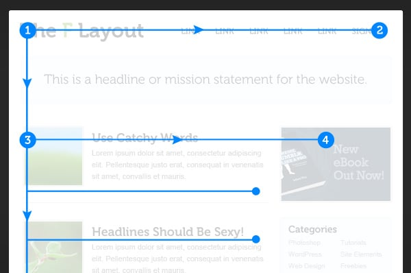
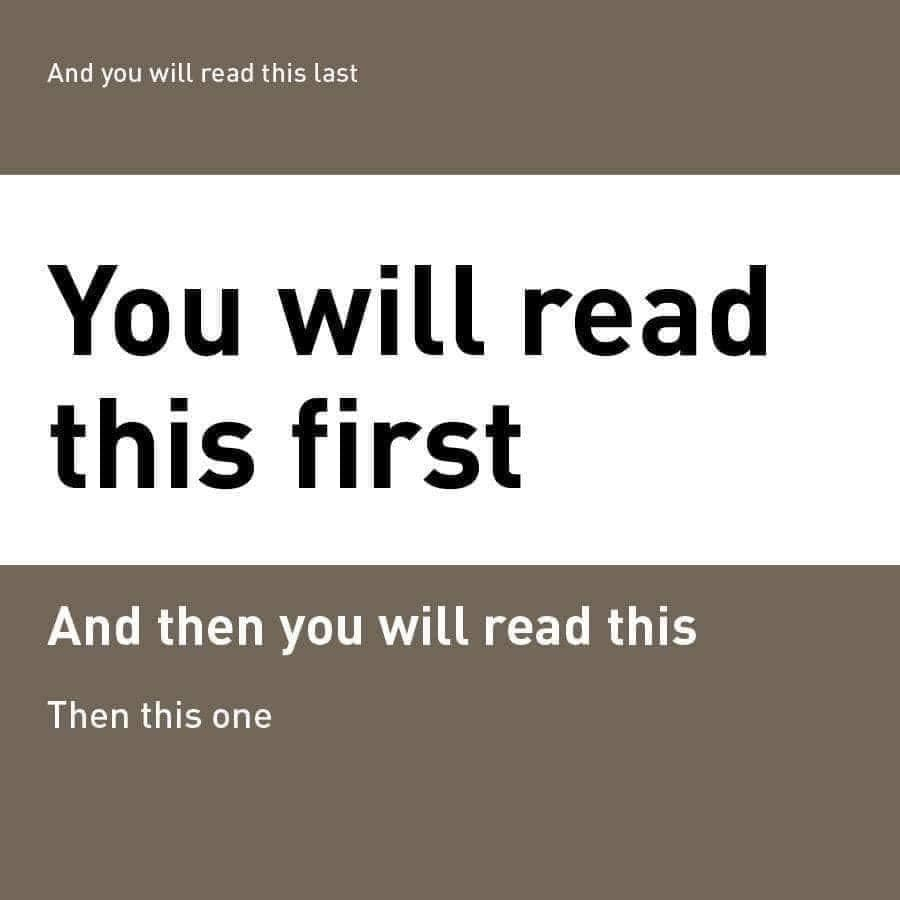
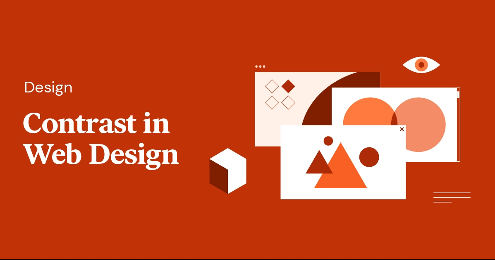

# Teorihandboken - UX och design (UD)
Studerande: Fredrik Gullin

## UD 1.1 Grafik och design för webbsidor
Vad är bra webb-design? Ligger skönhet i betraktarens öga? Gömmer sig djävulen i detaljerna? Vad skapar ett bra helhetsintryck?

För att kunna besvara dessa frågor bör vi sätta oss in i hur ögat tolkar intryck, information och saker.

Inom webb-design och UX- och UI-design stöter man på begreppet **visuell hierarki** som är kort sagt är en metod för att ordna element på till exempel en webbsida efter hur viktiga de är och därmed leda användarens öga så att det element med högst prioritet uppmärksammas först.

Man kan med hjälp av storlek, färg och kontrast få ett element att sticka ut vilket gör det lättare att urskilja och på så vis på få användaren att instinktivt fokusera på det. Vilket av användaren även upplevs som helt naturligt. På detta sätt kan man även påverka hur en användare interagerar med webbsidan.

För att uppnå denna friktionsfria interaktion kan man använda olika mönster som en layout-strategi.  De två mest populära är ”F-layout” och ”Z-layout”.

F-mönstret är bra för hemsidor där man presenterar en större mängd text och leder ögat genom sidans flöde som bilden visar.

Z-mönstret kan användas då man vill presentera mer grafiskt innehåll som till exempel en stor bild (hero object).

Man vet också att större text läses först och man bör således välja en tydlig font med relevant storlek för rubriker med mera för att leda användarens öga och uppmärksamhet dit man vill.

Kontraster är även mycket användbart för att få visa element att sticka ut och på så vis dra till sig användarens uppmärksamhet.

Bäst blir det när detta kombineras på ett balanserat sätt. Dessa koncept återkommer även när man fokuserar på UX-design och användbarhet.

_Källa:_ Föreläsning med Sebastian Lindgren den 17 oktober 2022 - UX / UI

## UD 1.2 UX och användbarhet
När man arbetar med UX design och användbarhet så kan man implementera ovanstående metoder på olika sätt för att få användaren att instinktivt förstå hur hen kan interagera med sidan / appen på ett naturligt sätt.

_”Om en produkt behöver en manual för att användaren ska förstå hur man interagerar med produkten har designen misslyckats” – The psychology of everyday things, Donald A. Norman , year1988._

Även om citatet kommer från en gammal (och rolig) bok så är det grundläggande tankesättet fortfarande brukligt.

Så hur designar man en hemsida så att en användare instinktivt förstår hur hen ska interagera med sidan?

Jag kommer nu att gå igenom några exempel på tankesätt som kan hjälpa oss med detta.

**Knappar, länkar och klickbara element**
”Allt som går att klicka på måste kommunicera klickbarhet”. Detta kan man uppnå genom att ha ett konsekvent utseende på klickbara element som genomsyrar hela designen. Detta skulle innebära att knappar och länkar med mera alltid ser likadana så att användaren lätt kan känna igen detta. Det underlättare även för användaren om man har tydliga beskrivningar av va elementet gör.

**Navigation**
För att skapa bra förutsättningar för en lättnavigerad sida kan man använda färgteman, kontraster, balanserad layout med passande fördelning och avstånd mellan olika element. Man kan även till exempel använda ovannämnda F och Z mönster. För att göra sidan lätt att navigera bör den vara enkel, förutsägbar och konsekvent. Se även till att vara säker på att alla länkar funkar som de ska och att ”bakåtknappen” fungerar.

Länkar som leder till en extern sida bör märkas upp med en ikon som beskriver att det handlar om en extern länk. Länkar bör också sticka ut och ha en design där det framgår att det handlar om en länk samt att dessa är lätta att känna igen.

**Meny**
För att skapa en bra meny bör alla valmöjligheter vara tydliga och synliga. Viktiga alternativ bör kanske alltid vara synliga för användaren. Menyn bör även vara responsiv för att underlätta för användning på olika enheter med olika skärmstorlekar (gäller egentligen alla element på hela sidan), men även responsiv på ett sätt som kan underlätta för användare med olika funktionshinder så som nedsatt syn med mera.

I dagsläget finns det några vedertagna modeller för menyer som användare lätt känner igen så till exempel en dropdown-meny för klickbara element, hamburger-meny för responsivitet med anpassning för mindre skärmstorlekar, eller en klassisk nav-bar för större skärmar på t.ex. en laptop eller desktop dator.

**Font**
Som tidigare nämnt så uppmärksammas och läses en större font först. HTML har färdiga standarder för storlekar på rubriker och underrubriker (h1, h2 och h3 o.s.v.) som fungerar bra. Utöver detta bör man använda en tydlig font (som passar scenariot).

**Språk**
När det kommer till språk och textelement bör man undvika för tekniskt språk (så länge situationen inte behöver det). Man bör också undvika för långa textstycken och för långa meningar som gör texten svårläst. MAN BÖR ÄVEN AV SAMMA ANLEDNING UNDVIKA MENINGAR MED ENDAST VERSALER.

**Sökfunktion**
Om sidan innehåller en större mängd information med många olika artiklar bör man ha en sökfunktion. Sökfält brukar vara placerade uppe i högra hörnet på hemsidor och det kan vara bra att följa denna oskrivna regler då användare lätt kan hitta och känna igen sökfältet baserat på tidigare erfarenheter. Sökfältet bör vara begränsat till att kunna ta emot max 27 bokstäver.

_Källa:_ Föreläsning med Sebastian Lindgren den 17 oktober 2022 - UX / UI samt 20 oktober 2022 - användbarhet kognition

## UD 1.3 Riktlinjer för användbarhet
Beskriv rubriken här

## UD 1.4 Prototyping
Vad är en prototyp, och varför är det bra att använda prototyper när man utvecklar en webbsida?

När det kommer till webbutveckling pratar man främst om två olika sorters prototyper high- respektive low-fidelity prototyper.

**Low-fidelity prototyp**
En low-fidelity prototyp, även kallad _low-fi prototyp_, är en enkel skiss över en webbsidas övergripande design. Skissen kan vara på papper eller skapad i något program som till exempel Figma och syftar till att generera feedback om sidans design och upplägg. Skissen innehåller ingen funktionalitet och ska vara snabbt framtagen och okomplicerad.

**Wizzard of OZ tekniken**
Ett kul och givande sätt att arbeta med low-fi prototyper är Wizzard of OZ tekniken. Tekniken går ut på att man på ett lekfullt sätt rollspelar med en "användare” som får prova olika design-upplägg och ge feedback på hur dessa känns. Man arbetar utifrån frågeställningen ”hur funkar det för dig att använda sidan i dess nuvarande form?”. Man dokumenterar därefter feedbacken man får från användaren som man kan använda som underlag för att ta fram _user-stories_. Som underlag använder man en low-fi skiss på papper där man klippt ut olika element som man pusslar ihop på olika sätt som användaren får testa och utvärdera. Tekniken är därmed ett effektivt och roligt sätt att skapa sig en förståelse för man utvecklar själva webbsidan.

**High-fidelity prototyp**
En high-fidelity prototyp, även kallad _high-fi prototyp_, är en mer komplicerad prototyp som ska efterlikna hur den färdigutvecklade produkten / webbsidan kommer se ut. En high-fi prototyp tas oftast fram efter ett flertal low-fi skisser och ofta i ett senare skede under själva utvecklingsprocessen och kan användas för att visa upp något som liknar slutresultatet för en kund på t.ex. ett demo-möte.

Prototypen kan vara själva webbsidan utan ”backend” funktionalitet (vilket ofta är skillnaden mellan en high-fi prototyp och själva slutprodukten). Prototypen syftar till att, tillsammans med kund, bestämma de sista design-detaljerna inför färdigställande.

En high-fi prototyp kräver dock mer förarbete och tar betydligt längre tid att ta fram än en low-fi prototyp.

**Hight-fi VS Low-fi**

**Low-fi**
    * Går fort
    * Endast layout
    * Ger uppfattning om var sidans element bör befinna sig

**High-fi**
    * Mer specifik
    * Liknar slutresultatet
    * Färdigt UI
    * Ger förståelse för sidans funktionalitet
    * Används vid demo för kund

**Varför bör man använda sig av prototyper?**

Det finns flera argument för att använda prototyper i samband med webbutveckling. Med hjälp av prototyper kan men tidigt skaffa sig en uppfattning om vad som behöver göras, vilket även sparar tid och budget. En UX-designer är mindre kostsam än en programmerare. Användning av t.ex. low-fi prototyper kan vara bra under projektets gång då allt kan förändras som till exempel upplägg, bilder och fonter med mera och även anpassa designen efter kundens önskemål.

Precis som med agila metoder kan man designa i iterationer för att få feedback om användarnas upplevelser.

_Designa → Testa → Feedback → Repeat_

## UD 1.5 Personas och målgruppsanalys
Beskriv rubriken här

## UD 1.6 Empiriska metoder
Beskriv rubriken här

## UD 1.7 Grundläggande kognitionspsykologi
Beskriv rubriken här
