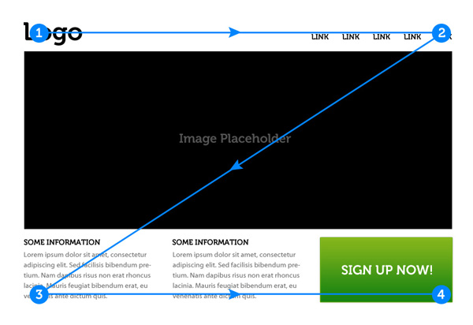

# Teorihandboken - UX och design (UD)
Studerande: Fredrik Gullin

## UD 1.1 Grafik och design för webbsidor
Vad är bra webb-design? Ligger skönhet i betraktarens öga? Gömmer sig djävulen i detaljerna? Vad skapar ett bra helhetsintryck?

För att kunna besvara dessa frågor bör vi sätta oss in i hur ögat tolkar intryck, information och saker.

Inom webb-design och UX- och UI-design stöter man på begreppet **visuell hierarki** som är kort sagt är en metod för att ordna element på till exempel en webbsida efter hur viktiga de är och därmed leda användarens öga så att det element med högst prioritet uppmärksammas först.

Man kan med hjälp av storlek, färg och kontrast få ett element att sticka ut vilket gör det lättare att urskilja och på så vis på få användaren att instinktivt fokusera på det. Vilket av användaren även upplevs som helt naturligt. På detta sätt kan man även påverka hur en användare interagerar med webbsidan.

För att uppnå denna friktionsfria interaktion kan man använda olika mönster som en layout-strategi.  De två mest populära är ”F-layout” och ”Z-layout”.

F-mönstret är bra för hemsidor där man presenterar en större mängd text och leder ögat genom sidans flöde som bilden visar.

Z-mönstret kan användas då man vill presentera mer grafiskt innehåll som till exempel en stor bild (hero object).

Man vet också att större text läses först och man bör således välja en tydlig font med relevant storlek för rubriker med mera för att leda användarens öga och uppmärksamhet dit man vill.

Kontraster är även mycket användbart för att få visa element att sticka ut och på så vis dra till sig användarens uppmärksamhet.

Bäst blir det när detta kombineras på ett balanserat sätt. Dessa koncept återkommer även när man fokuserar på UX-design och användbarhet.

## UD 1.2 UX och användbarhet
Beskriv rubriken här

## UD 1.3 Riktlinjer för användbarhet
Beskriv rubriken här

## UD 1.4 Prototyping
Beskriv rubriken här

## UD 1.5 Personas och målgruppsanalys
Beskriv rubriken här

## UD 1.6 Empiriska metoder
Beskriv rubriken här

## UD 1.7 Grundläggande kognitionspsykologi
Beskriv rubriken här
